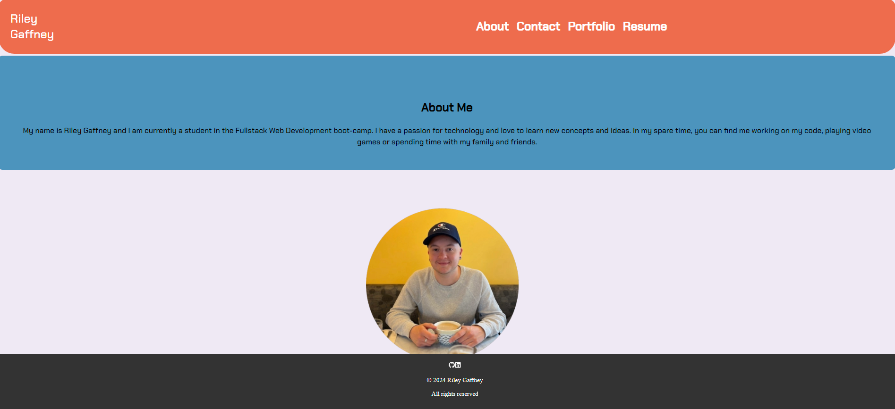

# My-React-Portfolio

## Description
In this project I showcase my knowledge in react by creating a personal portfolio. 

### Installation
From the "My-React-Portfolio" repository (https://github.com/RG-GitUser/My-React-Portfolio) select the "Code" dropdown.
Using the "Code" dropdown, click on "SSH".
On the "SSH" tab, select the "copy" button next to the address.
Next, open your git bash terminal (or for mac users, homebrew)
Use the command "git clone" and "insert coppied SSH key here" then press enter.
Enter the "cd "enter path here" " command to navigate to the correct directory.
You now have the repository cloned to your system! To verify, the command "ls" to view the items listed inside of the repository.

### Usage

Users are able to navigate through multiple pages to view, About, Contact, Portfolio and download my Resume. 

### Screenshot: 

### Credits
full stack Xpert Learning Assistant

devdocs.io: https://devdocs.io

youtube.com